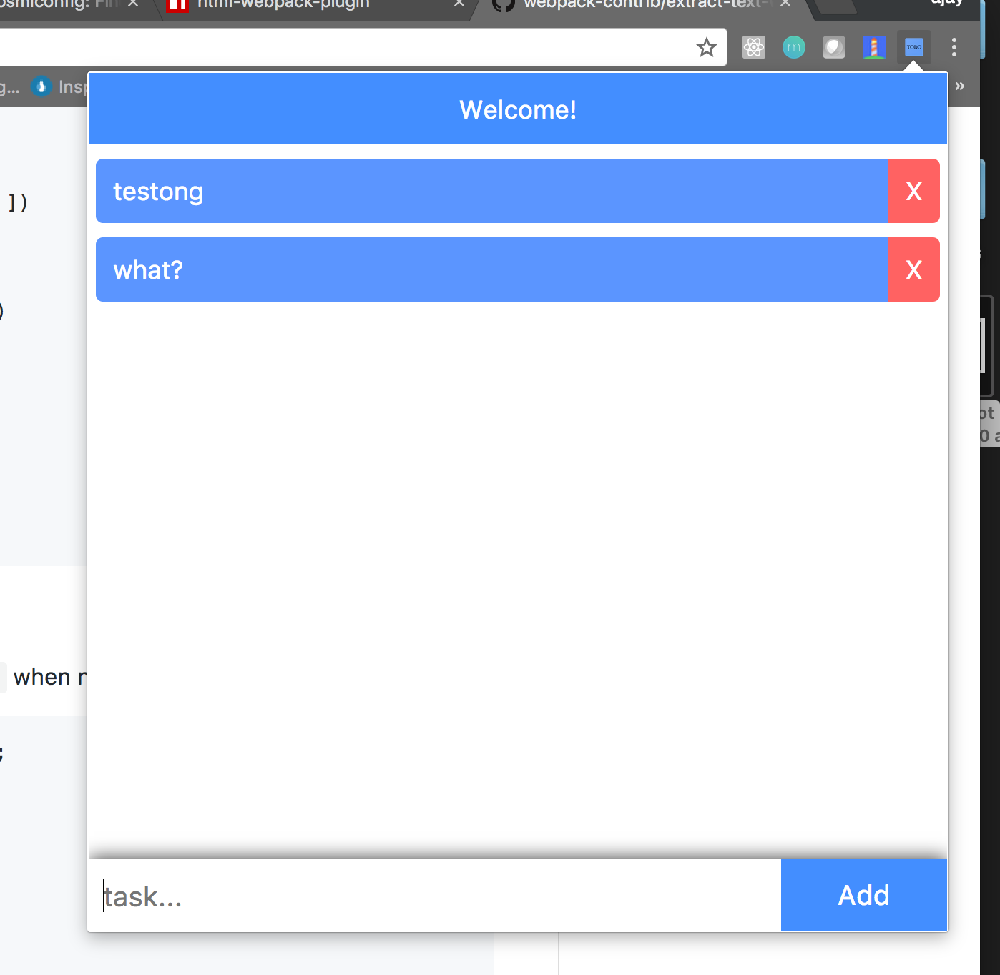

# Todo Chrome Extension

Todo list on the chrome.

### Setup

Pre-requisites:

>node

>yarn

clone (or fork and clone) the repo.

`git clone `

install dependencies:

`yarn`

compile and start watching files:

`yarn dev`

add unpackged extension to chrome

1. go to url : **chrome://extensions/** (on google chrome)
2. check the developer mode option on top right corner of the page
3. click the button **Load unpackaged extension**
4. navigate to <i>dist</i> folder of the project and click select
5. on top right corner you would see Todo icon, click the icon
6. continue hacking :)

tech used:

1. react (view library)
2. babel (transpiling es2015)
2. webpack (bundling and unimifinig prod build)

### Contributers

Build by :heart: by [Ajay Narain Mathur](https://github.com/ajaymathur) 

